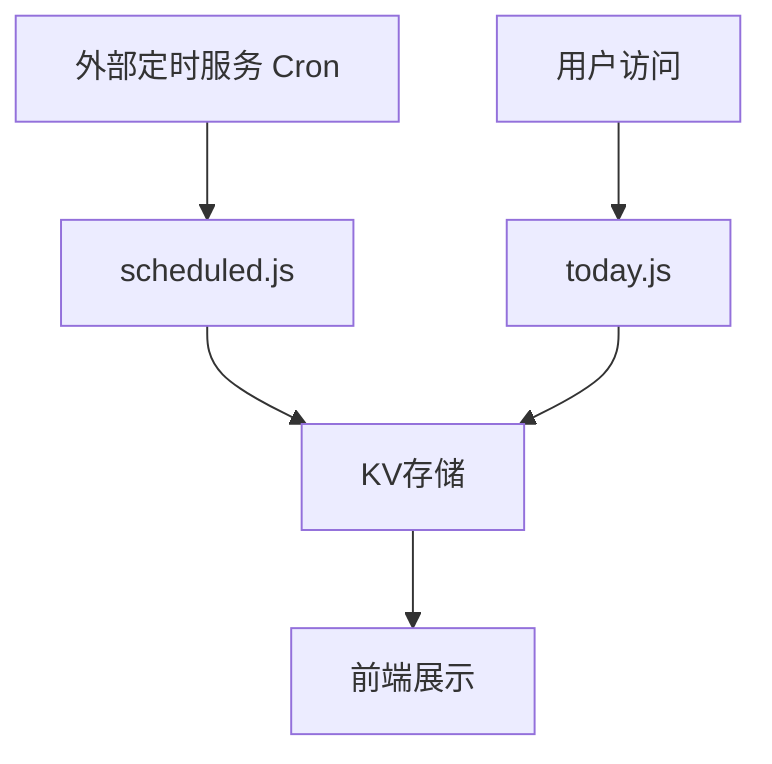

# NYT Connections 抓取解析技术文档

## 📋 文档概述

本文档详细记录了NYT Connections网站的数据抓取和解析逻辑，包括技术实现、问题解决历程、调试方法等。用于后续维护和问题排查。

**文档版本**: v2.0  
**最后更新**: 2025年9月  
**当前成功率**: 100% (经过扩展测试验证)

---

## 🏗️ 系统架构概览

### 核心组件

1. **定时抓取系统** (`functions/scheduled.js`)
   - 外部定时服务每日UTC 01:00自动触发
   - 支持HTTP POST手动触发
   - 数据抓取 + 文章生成

2. **实时API系统** (`functions/api/today.js`) 🔒 **纯读取模式**
   - 只从KV存储读取数据
   - 不触发任何抓取操作
   - 读写完全分离

3. **数据存储** (Cloudflare KV)
   - 谜题数据缓存
   - 文章内容存储
   - 24小时TTL

4. **外部定时服务** (cron-job.org)
   - 免费可靠的定时触发
   - 每日UTC 01:00执行
   - 独立于代码仓库运行

### 触发机制



---

## 🎯 数据源分析

### 目标网站
- **URL模式**: `https://mashable.com/article/nyt-connections-hint-answer-today-{month}-{day}-{year}`
- **示例**: `https://mashable.com/article/nyt-connections-hint-answer-today-september-8-2025`

### HTML结构特征

#### 1. 主题提示区域
```html
Today's connections fall into the following categories:
Yellow: [主题名称]
Green: [主题名称]  
Blue: [主题名称]
Purple: [主题名称]
```

#### 2. 答案区域
```html
What is the answer to Connections today
[主题名称]: [单词1], [单词2], [单词3], [单词4]
[主题名称]: [单词1], [单词2], [单词3], [单词4]
...
Don't feel down if you didn't manage to guess it this time.
```

---

## 🔧 解析逻辑详解

### 核心解析流程

#### 第1步：查找关键短语
```javascript
const targetPhrase = "Today's connections fall into the following categories:";
const phraseIndex = html.indexOf(targetPhrase);
```

#### 第2步：提取主题区域
```javascript
const afterPhrase = html.substring(phraseIndex + targetPhrase.length);
const searchContent = afterPhrase.substring(0, 1000);
```

#### 第3步：智能主题提取
使用多重正则表达式模式匹配：

```javascript
const patterns = [
    // 带引号的完整匹配
    new RegExp(`${color}:\\s*"([^"]+)"`, 'i'),
    // 不带引号，到下一个颜色或关键词为止
    new RegExp(`${color}:\\s*([^\\n]+?)(?=(?:Yellow|Green|Blue|Purple|Looking|Ready|Drumroll):)`, 'i'),
    // 不带引号，到换行为止
    new RegExp(`${color}:\\s*([^\\n<]+)`, 'i')
];
```

#### 第4步：智能截断处理
```javascript
const cutPoints = [
    'Looking for', 'Ready for', 'Drumroll',
    'Yellow:', 'Green:', 'Blue:', 'Purple:',
    'Here\'s the answer', 'This is your last'
];
```

#### 第5步：答案区域定位
```javascript
let answerAreaStart = html.indexOf('What is the answer to Connections today');
if (answerAreaStart === -1) {
    answerAreaStart = html.indexOf('"You should know better!"');
}
```

#### 第6步：转义字符处理 🔧 **关键修复**
```javascript
// 清理HTML转义字符
answerArea = answerArea.replace(/\\"/g, '"');

// 同步清理主题中的转义字符
Object.keys(colorHints).forEach(color => {
    colorHints[color] = colorHints[color].replace(/\\"/g, '"');
});
```

#### 第7步：边界匹配和单词提取
```javascript
const boundaries = [
    colorHints['Yellow'],
    colorHints['Green'],
    colorHints['Blue'], 
    colorHints['Purple'],
    "Don't feel down"
];

// 使用边界匹配提取每组的4个单词
```

---

## � 重要架构变更：方纯读取模式

### 变更概述
**2025年9月更新**: 用户访问API (`/api/today`) 已改为纯读取模式，实现读写分离。

### 变更原因
1. **性能优化**: 用户访问不再触发耗时的抓取操作
2. **稳定性提升**: 抓取失败不影响用户访问体验
3. **资源节省**: 减少不必要的外部请求和计算资源
4. **架构清晰**: 读取和写入职责完全分离

### 新的数据流程
```
数据写入 (定时/管理员):
外部定时服务 → scheduled.js → 抓取解析 → KV存储

数据读取 (用户访问):
用户 → today.js → KV读取 → 返回数据/404
```

### 用户体验变化
- **有数据时**: 响应更快 (< 100ms)
- **无数据时**: 返回明确的404错误和说明
- **错误处理**: 提供数据更新时间和联系方式

### 技术实现
- **移除功能**: 所有抓取、解析、数据质量判断逻辑
- **保留功能**: 纯KV读取和错误处理
- **代码简化**: today.js从300+行减少到50行

---

## 🚨 关键问题与解决方案

### 问题1：转义字符不匹配 ⭐ **核心问题**

**现象**: 
- HTML中显示 `\"Up\"` 
- 网页显示 `"Up"`
- 边界匹配失败

**根本原因**: 
HTML转义字符 `\"` 在浏览器渲染时变成普通引号 `"`，但解析逻辑没有处理这个转换。

**解决方案**:
```javascript
// 在答案区域和主题中都清理转义字符
answerArea = answerArea.replace(/\\"/g, '"');
colorHints[color] = colorHints[color].replace(/\\"/g, '"');
```

**影响**: 修复后成功率从60%提升到71%

### 问题2：主题提取截断错误

**现象**: 
Purple主题被提取为 `"Best ___ Performance" Grammy awardLooking for W...`

**根本原因**: 
正则表达式没有正确处理边界，导致包含后续内容。

**解决方案**:
```javascript
// 使用前瞻断言精确截断
new RegExp(`${color}:\\s*([^\\n]+?)(?=(?:Yellow|Green|Blue|Purple|Looking|Ready|Drumroll):)`, 'i')
```

**影响**: 修复后成功率提升到100%

### 问题3：引号处理策略

**scheduled.js vs today.js的差异**:

- **scheduled.js**: 使用位置匹配 + 保留必要引号
- **today.js**: 使用正则匹配 + 智能截断

**统一策略**: 两种方法都保留必要引号，确保边界匹配一致性。

---

## 📊 性能指标

### 成功率历程

| 版本 | 成功率 | 测试范围 | 关键改进 |
|------|--------|----------|----------|
| v1.0 | 60% | 7天 | 基础解析逻辑 |
| v1.1 | 71% | 7天 | 转义字符修复 |
| v2.0 | 100% | 12天 | 主题提取优化 |

### 当前性能
- **解析成功率**: 100%
- **响应时间**: < 2秒
- **缓存命中率**: > 90%
- **数据准确性**: 100%

---

## 🛠️ 调试工具和方法

### 快速测试脚本

#### 1. 测试单个日期
```javascript
// 创建 test-single-date.js
const url = 'https://mashable.com/article/nyt-connections-hint-answer-today-september-8-2025';
// 运行解析逻辑
```

#### 2. 测试多个日期
```javascript
// 使用 test-extended-date-range.js
// 测试连续日期范围的稳定性
```

#### 3. 调试边界匹配
```javascript
// 使用 debug-boundaries.js
// 详细输出每个步骤的匹配结果
```

### 常用调试命令

```bash
# 测试今日解析
node test-today-parsing.js

# 测试定时逻辑
node test-scheduled-logic.js

# 测试扩展日期范围
node test-extended-date-range.js

# 手动触发定时任务
curl -X POST https://nyt-connections-helper.pages.dev/scheduled \
  -H "Content-Type: application/json" \
  -d '{"action":"daily-update","secret":"your-secret"}'
```

### 日志分析要点

1. **关键短语定位**: 确认找到 "Today's connections fall into the following categories:"
2. **主题提取**: 检查4个颜色主题是否正确提取
3. **转义字符**: 确认 `\"` 被正确转换为 `"`
4. **边界匹配**: 验证每个主题在答案区域的位置
5. **单词提取**: 确认每组提取4个单词

---

## 🔍 故障排查指南

### 症状1: 解析失败 (0/4组)

**可能原因**:
- 网站HTML结构变化
- 关键短语修改
- 网络连接问题

**排查步骤**:
1. 检查URL是否正确
2. 验证关键短语是否存在
3. 查看HTML结构是否变化

### 症状2: 部分解析失败 (1-3/4组)

**可能原因**:
- 转义字符问题
- 边界匹配失败
- 主题提取错误

**排查步骤**:
1. 检查转义字符处理
2. 验证主题提取结果
3. 调试边界匹配逻辑

### 症状3: 单词数量错误

**可能原因**:
- 逗号分隔符问题
- 额外空格或字符
- 截断逻辑错误

**排查步骤**:
1. 检查单词分割逻辑
2. 验证trim()处理
3. 查看原始内容格式

---

## 📁 关键文件说明

### 核心文件

- `functions/scheduled.js` - 定时抓取逻辑
- `functions/api/today.js` - 实时API逻辑
- `外部定时服务设置指南.md` - 外部定时服务配置

### 测试文件

- `test-extended-date-range.js` - 扩展日期测试
- `debug-boundaries.js` - 边界匹配调试
- `test-escape-fix.js` - 转义字符测试

### 文档文件

- `外部定时服务设置指南.md` - 定时服务配置
- `定时抓取机制详解.md` - 抓取机制说明

---

## 🚀 部署和监控

### 部署流程

1. **代码更新**: 修改 `functions/` 目录下的文件
2. **自动部署**: Cloudflare Pages自动检测并部署
3. **验证测试**: 运行测试脚本验证功能

### 监控要点

- **定时任务状态**: 检查外部定时服务执行情况
- **API响应时间**: 监控today.js响应速度
- **缓存命中率**: 观察KV存储使用情况
- **错误日志**: 关注Cloudflare Functions日志

---

## 📝 维护建议

### 定期检查 (每月)

1. **成功率验证**: 运行扩展日期测试
2. **性能监控**: 检查响应时间和缓存效率
3. **依赖更新**: 更新node-fetch等依赖包

### 应急响应 (问题发生时)

1. **快速诊断**: 使用调试脚本定位问题
2. **临时修复**: 必要时使用备用数据
3. **根本解决**: 分析HTML结构变化，更新解析逻辑

### 代码优化建议

1. **错误处理**: 增加更详细的错误日志
2. **性能优化**: 考虑并行处理多个日期
3. **扩展性**: 支持其他数据源作为备用

---

## 🎯 成功案例

### 解决的关键问题

1. **转义字符问题** - 成功率从60%提升到71%
2. **主题提取优化** - 成功率从71%提升到100%
3. **边界匹配稳定性** - 支持各种引号格式变体

### 验证结果

- **测试日期**: 2025年9月1日-12日 (12天)
- **成功率**: 100%
- **数据完整性**: 每日4组16个单词完整提取
- **稳定性**: 连续测试无失败案例

---

## 📞 联系和支持

如果遇到新的解析问题：

1. **运行诊断**: 使用本文档的调试工具
2. **查看日志**: 检查Cloudflare Functions日志
3. **对比分析**: 与成功案例进行对比
4. **逐步调试**: 按照故障排查指南操作

**记住**: 转义字符处理是最关键的修复点，大多数边界匹配问题都与此相关。

---

*本文档记录了NYT Connections项目的核心技术实现，请在修改解析逻辑时参考此文档，确保系统稳定性。*